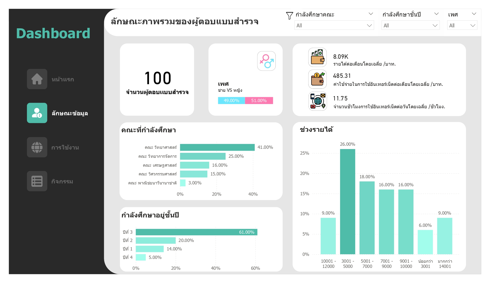
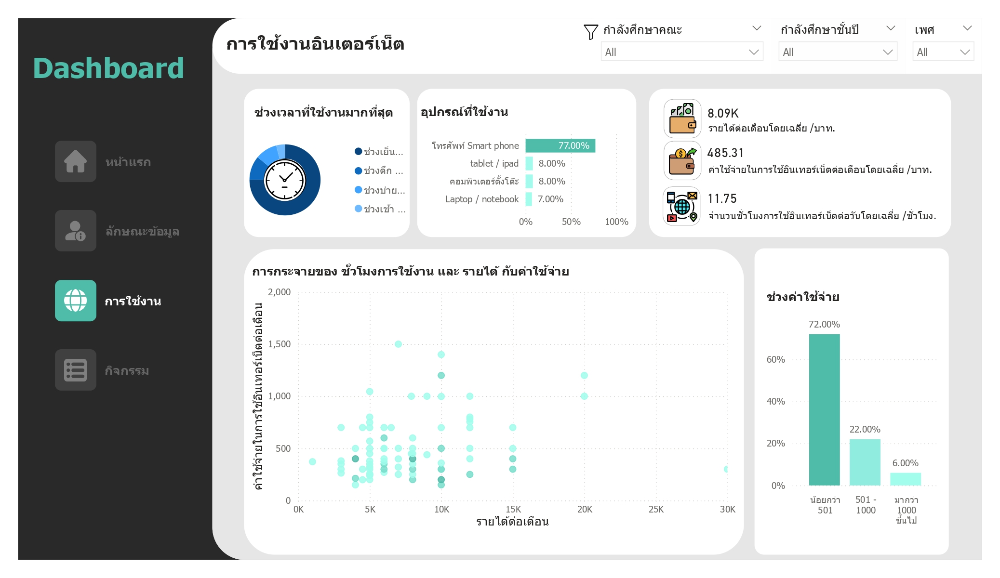
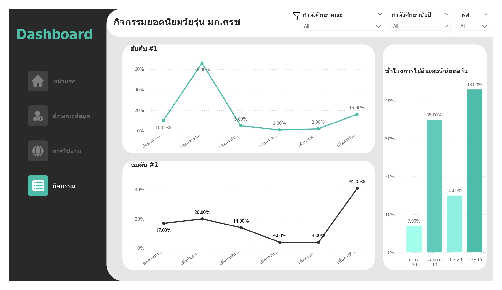

# Internet Usage Prediction with Regression – KU Sriracha Student Survey

## Overview
Surveyed internet usage patterns among Kasetsart University Sriracha Campus students, followed by data analysis and predictive modeling.  The project involved data collection, visualization, and the development of regression models to predict internet expenditure based on usage patterns and demographic factors.

## Visualizations

### Overall Survey Results

### Internet Usage Patterns

### Popular Online Activities

## Technologies Used
- Python 
- TensorFlow/Keras
- Scikit-learn
- Power BI

## How to Run
Open the notebooks in Jupyter or Google Colab 

